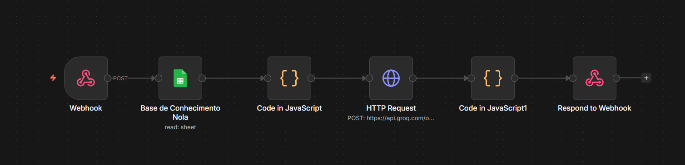
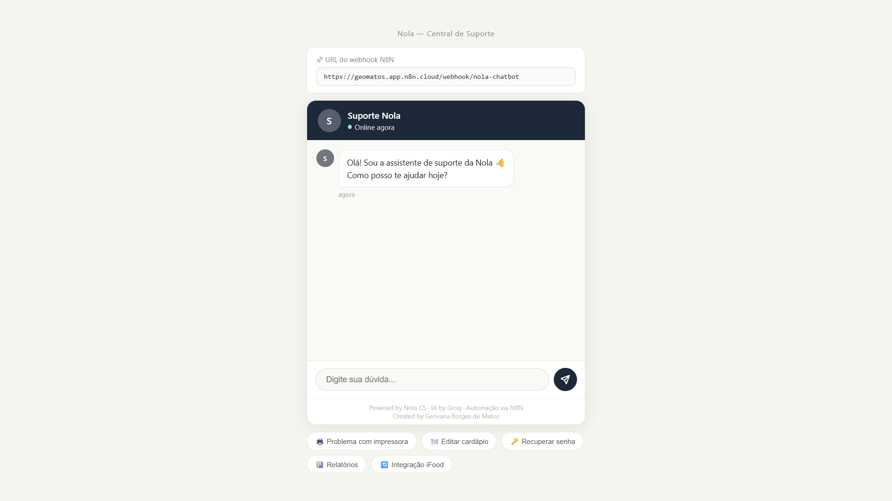

# Nola CS Chatbot

Projeto desenvolvido para um desafio técnico de estágio em Customer Success.

## Objetivo

Criar um chatbot automatizado utilizando N8N, Google Sheets e IA para responder dúvidas recorrentes de clientes de uma plataforma de gestão de restaurantes.

## Tecnologias utilizadas

* N8N
* Google Sheets
* Groq API (Llama 3.1)
* Webhooks
* JavaScript

## Funcionamento

O fluxo funciona da seguinte forma:

1. O usuário envia uma pergunta via Webhook;
2. O N8N recebe a mensagem;
3. O Google Sheets é consultado como base de conhecimento;
4. Um node Code organiza os dados;
5. A IA gera uma resposta baseada na base de conhecimento;
6. O chatbot responde de forma automatizada.

## Estrutura do fluxo



## Benefícios para Customer Success

* Redução de chamados repetitivos;
* Respostas mais rápidas;
* Escalabilidade do atendimento;
* Melhoria da experiência do cliente;
* Otimização operacional.

## Interface Web

Além do fluxo de automação no N8N, também foi desenvolvida uma interface web para tornar a interação com o chatbot mais simples e intuitiva.

A aplicação permite que usuários enviem perguntas diretamente para o webhook do N8N, recebendo respostas geradas pela IA com base na base de conhecimento armazenada no Google Sheets.

### Funcionalidades

* Interface de chat em tempo real;
* Integração com Webhook do N8N;
* Respostas automatizadas utilizando IA;
* Consulta dinâmica à base de conhecimento;
* Experiência inspirada em sistemas reais de suporte.

## Demonstração

### Interface do Chatbot



# Como utilizar

### 1. Clone o repositório

```bash id="rj3x7m"
git clone https://github.com/GeobdMatos/customer-success-ai-chatbot.git
```
---

### 2. Acesse a pasta do projeto

```bash id="0w2mkt"
cd customer-success-ai-chatbot
```

---

### 3. Execute a interface web

Abra o arquivo:

```text id="g0b5xt"
index.html
```

## Como funciona

O fluxo da aplicação funciona da seguinte forma:

```text id="0r7pva"
Usuário → Interface Web → Webhook N8N → Google Sheets → Groq AI → Resposta
```

1. O usuário envia uma pergunta pela interface web;
2. A mensagem é enviada para o webhook do N8N;
3. O Google Sheets é utilizado como base de conhecimento;
4. O node Code organiza o contexto;
5. A IA processa as informações;
6. O chatbot retorna uma resposta automatizada.

---


## Tecnologias utilizadas

* HTML
* CSS
* JavaScript
* N8N
* Google Sheets
* Groq API (Llama 3.1)

## Objetivo do projeto

Este projeto foi desenvolvido como solução para um desafio técnico de estágio em Customer Success, com foco em:

* automação de atendimento;
* experiência do usuário;
* eficiência operacional;
* aplicação prática de IA em suporte técnico.


## Observações

Este projeto foi desenvolvido com foco em simplicidade, automação e aplicabilidade prática para operações de Customer Success.
